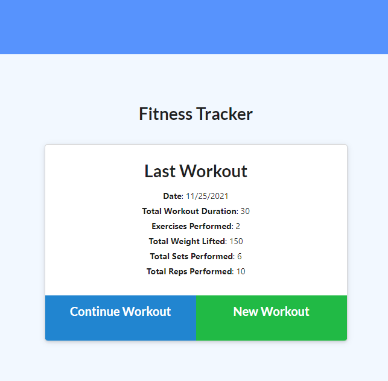
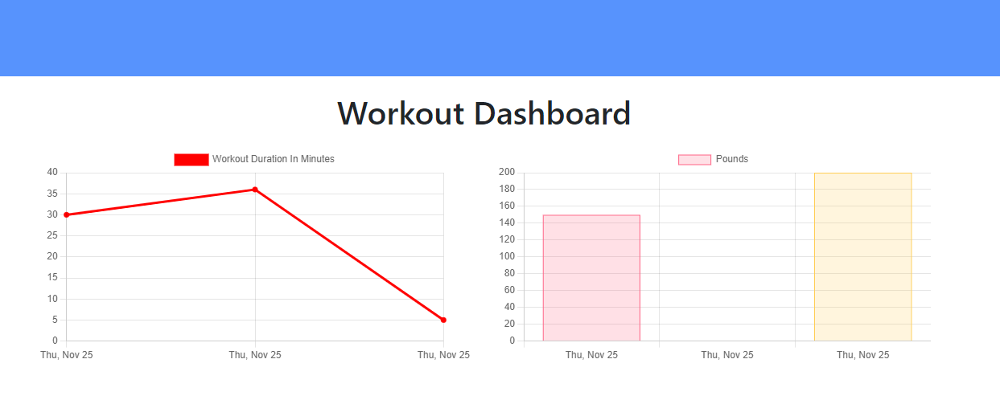

# fitness-tracker

## Description
This is a webapp that allows you to track your workouts and view statistics!

## Table of Contents
* [Installation](#installation)
* [Usage](#usage)
* [License](#license)
* [Contributing](#contributing)
* [Tests](#tests)
* [Developers and Contact Info](#developers-and-contact-info)

## Installation
Please clone this repo, install, run `npm run start`, and open localhost:3000.

## Usage
This app can be previewed at [https://krauz-fitness-tracker.herokuapp.com/](https://krauz-fitness-tracker.herokuapp.com/).

## License
MIT

## Contributing
Contributions are not open at this time.

## Tests
There are no tests to run prior to running.

## Developers and Contact Info
* https://github.com/mlkrauz
